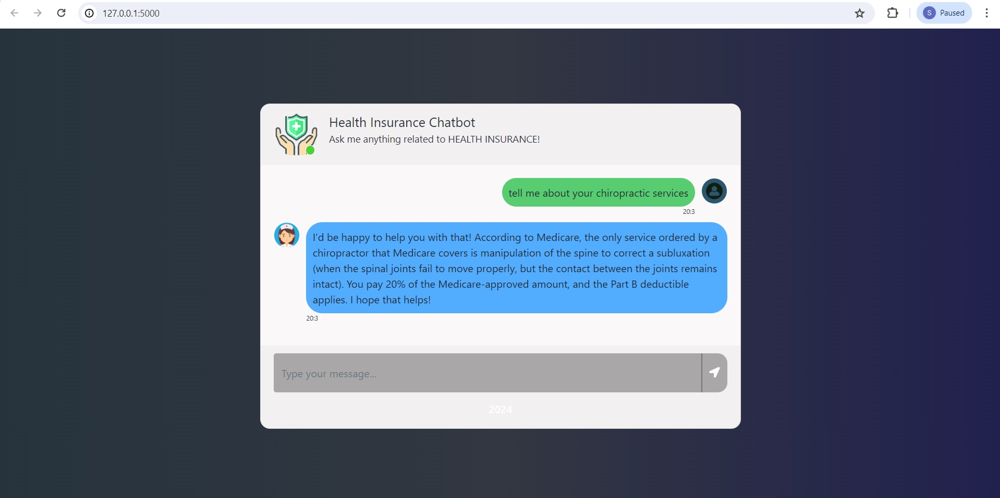

# Health Insurance Chatbot

### Introduction

The Health Insurance ChatBot is built using the Llama-2 model. The primary goal of this chatbot is to provide accurate and relevant health insurance-related information to users based on their queries. You can ask questions on health insurance policies, treatment, emergency services etc.. The application will provide relevant responses based on the knowledge base. Please note that the app will only respond to questions related to insurance and health care.

### Prerequisites - Tech Stacks

Before using the Llama2 Health Insurance Bot, make sure to have the following prerequisites installed on the system:

1. Python 3.8 or higher
2. Framework - Langchain
3. Frontend/webapp - Flask, HTML, CSS
4. LLM - meta llama 2
5. Vector DB - FAISS

### Installation

1. Replicate API Key: This is how we will apply the Llama2 model for our chatbot. Go to the Replicate website and sign up. Once you are signed up and logged in, navigate to this link to see your API Key:    https://replicate.com/account/api-tokens. Copy the key and save it for later.
   
2. Clone this repository to your local machine.

   ```bash
    git clone https://github.com/shalini-2020/Health_Insurance_Chatbot.git
    cd Health_Insurance_Chatbot
    ```
3. Create a Python virtual environment (optional but recommended):
    ```bash
    python -m venv insurance
    source .insurance/bin/activate  # On Windows, use: insurance\Scripts\activate
    ```
4. Install the required Python packages:
    ```bash
    pip install -r requirements.txt
    ```
### Description

The architecture of the project is divided into two main parts: the backend and the frontend.

#### Backend:

1. Data Ingestion: The backend starts with ingesting data from a set of documents.
2. Data Extraction: The data from the PDF is then extracted and processed.
3. Text Chunking: The extracted data is broken down into smaller chunks or parts. These chunks are then fed into the model.
4. Embedding: Each chunk of text is converted into a vector representation, known as embedding.
5. Semantic Index Building: A semantic index is built to connect these vectors, which aids in understanding the context and meaning of the text chunks.
6. Knowledge Base: The embeddings are stored in FAISS, a vector database.
   
#### Frontend:

1. User Query Processing: When a user asks a question, it is converted into a query embedding.
2. Knowledge Base Lookup: This query embedding is used to search the knowledge base for the most relevant result.
3. LLM Model Processing: The ranked results from the knowledge base are then passed through the LLM (Llama-2) model.
4. User Answer Generation: Finally, the model generates an answer to the user's question based on the information it has processed.

### Usage

To use the Health Insurance Chat App, follow these steps:

1. Run the ```app.py``` using the Python Cli. Execute the following command
```bash
python app.py
```

### Output




